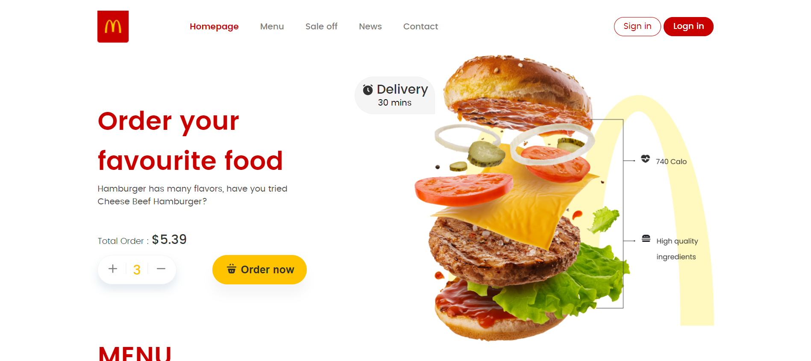

# McDonald's Website 🍔

## Website

This project is a recreation of the McDonald's website homepage built using HTML, CSS

## Features

* Responsive design
* Navigation menu
* ️Image slider
* Restaurant search
* ☎️ Contact information

## Use cases

* Portfolio piece for web developers
* Educational project for learning HTML, CSS(Grid , FlexBox)
* Reference for restaurant website design

## Links

* Website: [McDonald's](https://www.mcdonalds.com/)
* GitHub repository: ``` https://github.com/hzabbas/McDonald-s.git ```
## Screenshots



## Keywords

McDonald's, website, HTML, CSS, JavaScript, responsive design, navigation menu, image slider, restaurant search, contact information, portfolio, educational project, reference , flexBox , Css Grid